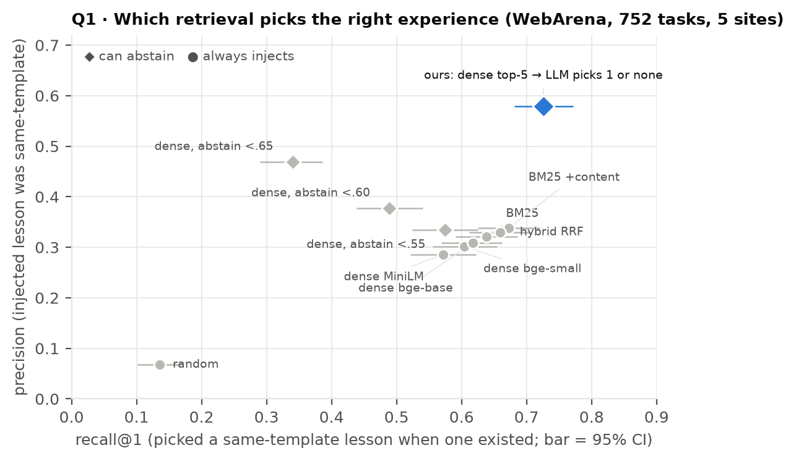
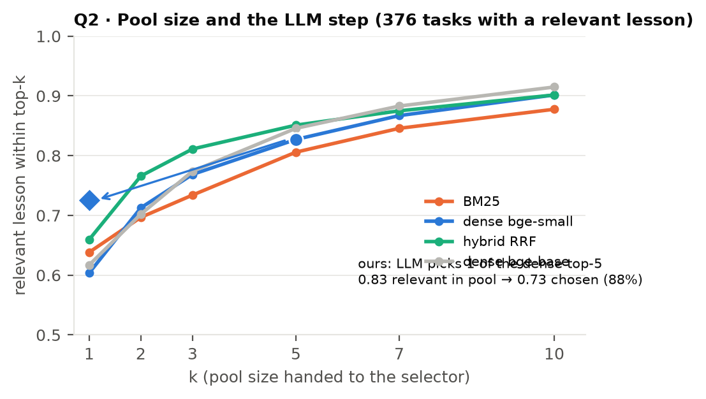
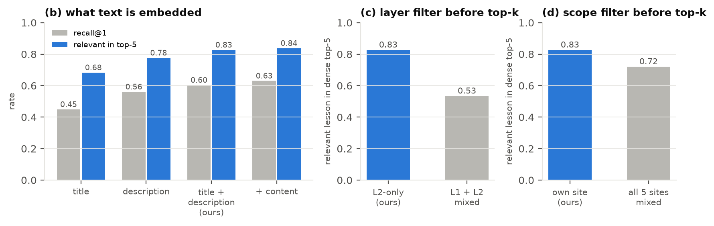
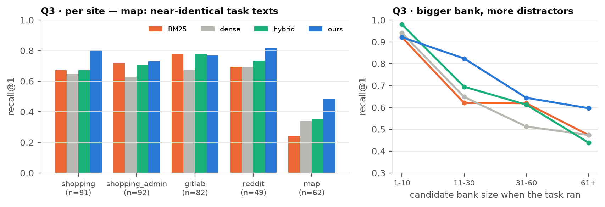

# 读端实验：embedding + LLM 选择能不能取到对的经验（2026-09-14）

一件事：我们的读端是"scope/layer 过滤 → cosine top-5（bge-small）→ LLM 从 5 条里挑唯一一条或一条不挑"。这里回答三个问题——它比别的检索方法更能挑中正确经验吗（比较）；这条链路里每一环拆掉会怎样（消融）；库更大、任务文本更像、跨站干扰更多时还站得住吗（挑战）。全部在五站实录的 L2 库上离线回放，数据和脚本都在仓库里。

## 怎么测

**回放**：五站各取一次全集配对 run 的 withmem 流（shopping 0811、shopping_admin 0818、gitlab 0815、reddit 0814、map 0813）。做第 i 题时候选库 = 前面的题已写出的 L2（和真跑一样，后写的看不见），752 道题，其中 376 道在做题时库里已有同模板经验。查询 = 任务 intent；条目文本 = title + description（系统实际嵌入的文本）。

**"对的经验"**：来源题和当前题同一个 intent 模板。依据是实测的作用域——同模板 +9.4，跨模板 +0.6（WA_SCORES.md）。库里没有同模板经验的题，正确动作是什么都不注。

**规则**：每种方法只准选一条或弃权，和系统一致。指标：recall@1（有同模板经验时选中它）、precision（注入里同模板的比例）、无相关时正确弃权、决策准确率 = (选中 + 正确弃权) / 全部题。CI 是按题 bootstrap。**ours(as-run)** 是那次 run 里 `select_lesson` 实际的注入决定（wa_retrieve 事件），其他方法在同一候选库上离线模拟。

脚本 `scripts/eval_retrieval_suite.py`；逐题明细 `runs/retrieval_suite_wa.json`；汇总 `runs/retrieval_suite_summary.json`；图 `paper/figures/R1–R4`。

## Q1 · 比较：和 BM25 / dense / hybrid / 阈值弃权比

| 方法 | recall@1 [95% CI] | precision | 无相关时正确弃权 | 决策准确率 [95% CI] | 注入率 |
|---|---|---|---|---|---|
| random | 0.14 [0.10, 0.17] | 0.07 | 0.00 | 0.07 [0.05, 0.09] | 1.00 |
| bm25 | 0.64 [0.59, 0.69] | 0.32 | 0.01 | 0.33 [0.29, 0.36] | 0.99 |
| bm25+content | 0.67 [0.62, 0.72] | 0.34 | 0.01 | 0.34 [0.31, 0.37] | 1.00 |
| dense[bge-small] | 0.60 [0.56, 0.65] | 0.30 | 0.00 | 0.30 [0.27, 0.34] | 1.00 |
| dense[bge-base] | 0.62 [0.57, 0.66] | 0.31 | 0.00 | 0.31 [0.28, 0.34] | 1.00 |
| dense[MiniLM-L6] | 0.57 [0.52, 0.62] | 0.29 | 0.00 | 0.29 [0.25, 0.32] | 1.00 |
| hybrid | 0.66 [0.61, 0.71] | 0.33 | 0.00 | 0.33 [0.30, 0.36] | 1.00 |
| dense+thr0.55 | 0.57 [0.52, 0.62] | 0.33 | 0.17 | 0.37 [0.34, 0.41] | 0.86 |
| dense+thr0.6 | 0.49 [0.44, 0.54] | 0.38 | 0.41 | 0.45 [0.41, 0.48] | 0.65 |
| dense+thr0.65 | 0.34 [0.29, 0.39] | 0.47 | 0.72 | 0.53 [0.49, 0.57] | 0.36 |
| **ours(as-run)** | 0.73 [0.68, 0.77] | 0.58 | 0.62 | 0.67 [0.64, 0.71] | 0.63 |

配对差（决策准确率）ours − 最强基线 dense+thr0.65：+0.142，95% CI [+0.096, +0.189]，逐题赢 215 / 输 108。

三种纯检索器（BM25、dense、hybrid）recall 0.60–0.67 差别不大，换更强的 embedder（bge-base、MiniLM）也只在 ±0.03 里动；它们的问题不是排序而是每题必注——一半的题库里没有同模板经验，所以 precision 只有三成。给 dense 加相似度阈值弃权，precision 每涨一格 recall 就塌一格（τ=0.65：precision 0.47、recall 0.34）。我们的链路是唯一两头都拿到的：recall 0.73、precision 0.58、该弃权时 0.62 弃权，决策准确率 0.67。

## Q2 · 消融：这条链路每一环值多少

**(a) 交给 LLM 的池子大小 k。** 相关经验落在各排序器 top-k 里的比例：

| k | bm25 | bm25+content | dense[bge-small] | dense[bge-base] | dense[MiniLM-L6] | hybrid |
|---|---|---|---|---|---|---|
| 1 | 0.64 | 0.67 | 0.60 | 0.62 | 0.57 | 0.66 |
| 2 | 0.70 | 0.78 | 0.71 | 0.70 | 0.68 | 0.77 |
| 3 | 0.73 | 0.81 | 0.77 | 0.77 | 0.75 | 0.81 |
| 5 | 0.81 | 0.84 | 0.83 | 0.85 | 0.83 | 0.85 |
| 7 | 0.85 | 0.89 | 0.87 | 0.88 | 0.88 | 0.88 |
| 10 | 0.88 | 0.91 | 0.90 | 0.91 | 0.92 | 0.90 |

dense top-5 池子里有相关经验的比例是 0.83，LLM 最终选对 0.73，也就是池子有货时它选对 88%。漏掉的主要在召回那一步不在挑选那一步；k 从 5 加到 10 能把召回上限从 0.83 抬到 0.90，代价是 LLM 要在更多相似候选里分辨。

**(b) 嵌入什么文本。** 我们只嵌 title + description、故意不嵌 content：

| 嵌入文本 | recall@1 | 相关在 top-5 |
|---|---|---|
| title | 0.45 | 0.68 |
| description | 0.56 | 0.78 |
| title+description（我们） | 0.60 | 0.83 |
| title+description+content | 0.63 | 0.84 |

加 content 几乎不涨（0.83 → 0.84），只嵌 title 掉到 0.68。description 是检索键，这也是写端纪律要求把适用条件写进 description 的原因。

**(c) 先按 layer 过滤再取 top-k。** L1 条目比 L2 多四到七倍（shopping 560 vs 99）。不先过滤，dense top-5 里平均 78% 被 L1 占掉（系统从不注入 L1），相关 L2 还留在 top-5 的比例从 0.83 掉到 0.53。

**(d) 先按 scope（本站）过滤。** 把五站的 L2 库混在一起当候选：相关经验在 top-5 的比例 0.83 → 0.72，混池 top-5 里 38% 是别站的经验，top-1 有 22% 的题会把别站经验注进来。

## Q3 · 挑战：更像的任务文本、更大的库

| 站 | 题数 | 有相关 | BM25 | dense | hybrid | **ours** | ours 决策准确率 |
|---|---|---|---|---|---|---|---|
| shopping | 186 | 91 | 0.67 | 0.65 | 0.67 | **0.80** | 0.63 |
| shopping_admin | 179 | 92 | 0.72 | 0.63 | 0.71 | **0.73** | 0.78 |
| gitlab | 178 | 82 | 0.78 | 0.67 | 0.78 | **0.77** | 0.77 |
| reddit | 103 | 49 | 0.69 | 0.69 | 0.73 | **0.82** | 0.72 |
| map | 106 | 62 | 0.24 | 0.34 | 0.35 | **0.48** | 0.36 |

map 是所有方法的短板：同一站上"从 A 到 B 开车/走路多久"这类任务只差地名，文本几乎一样，纯检索 recall 0.24–0.35，我们 0.48——LLM 门控能读出"这道题要的是路线时长的单位"这类差别，但也只救回一半。

| 候选库大小 | 题数（有相关） | BM25 | dense | hybrid | **ours** |
|---|---|---|---|---|---|
| 1-10 | 97（51） | 0.92 | 0.94 | 0.98 | **0.92** |
| 11-30 | 231（108） | 0.62 | 0.65 | 0.69 | **0.82** |
| 31-60 | 295（160） | 0.62 | 0.51 | 0.61 | **0.64** |
| 61+ | 129（57） | 0.47 | 0.47 | 0.44 | **0.60** |

库越大干扰越多，纯检索从 0.92–0.98 掉到 0.44–0.47；我们从 0.92 掉到 0.60，掉得最慢。这就是"库一大 top-k 就被灌水淹死"那条老教训的定量版，也是 LLM 那一步存在的理由。

## SWE-bench Verified（冻结 243 条 django 库，114 道留出题）

SWE 没有模板结构，"对的经验"用代理定义：条目来源题的 gold patch 与目标题的 gold patch 至少碰到同一个文件。114 道里只有 56 道库里存在这样的条目。系统在 SWE 上是 top-4 注入；asrun-plain 是 abl_plain 实际注入的 dense top-4，asrun-gate 是 abl_gate 里 LLM 闸门留下的子集。

bank items with known source: 243/243
targets: 114; tasks with >=1 file-overlap-relevant item in bank: 56

| method | 平均注入条数/题 | 注入条目中相关比例 (precision) | 有相关时至少命中一条 (recall) | 无相关时正确弃权 |
|---|---|---|---|---|
| bm25@1 | 1.00 | 0.12 | 0.25 | 0.00 |
| dense@1 | 1.00 | 0.15 | 0.30 | 0.00 |
| hybrid@1 | 1.00 | 0.12 | 0.25 | 0.00 |
| bm25@4 | 4.00 | 0.09 | 0.45 | 0.00 |
| dense@4 | 4.00 | 0.11 | 0.54 | 0.00 |
| hybrid@4 | 4.00 | 0.11 | 0.62 | 0.00 |
| asrun-plain(dense@4) | 4.00 | 0.11 | 0.54 | 0.00 |
| asrun-gate(llm subset) | 1.33 | 0.16 | 0.30 | 0.29 |

所有方法 precision 都在 0.1 左右——库里的经验和目标题在文件层面基本不重叠（和 7 月"Verified 题目之间知识几乎不重叠"的结论一致）。闸门把注入从 4 条砍到 1.33 条、precision 0.11 → 0.16、29% 的无相关题正确弃权，但 recall 0.54 → 0.30。这个 bench 上方法差异被"库里没矿"盖住。

## Mind2Web

没有。本机没有 Mind2Web 的库文件。

## 还没跑的臂（要网关，等 VPN）

LLM 直接看整个候选库挑一条或弃权（llm-direct）、我们的链路用同一模型现跑复现（ours-replay，和 as-run 对照）、LLM 接 BM25 top-5、LLM 接 hybrid top-5。代码在 `scripts/eval_retrieval_methods.py --online`，网关连上就能跑。
